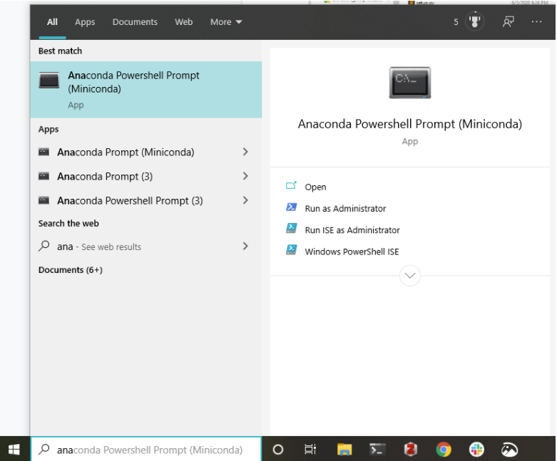
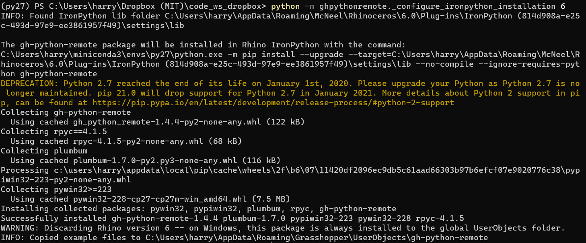
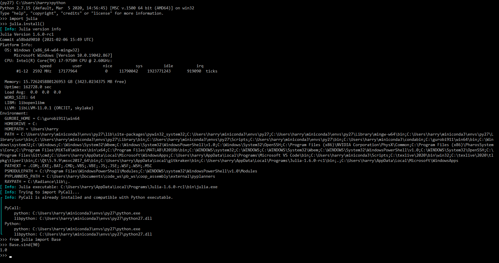
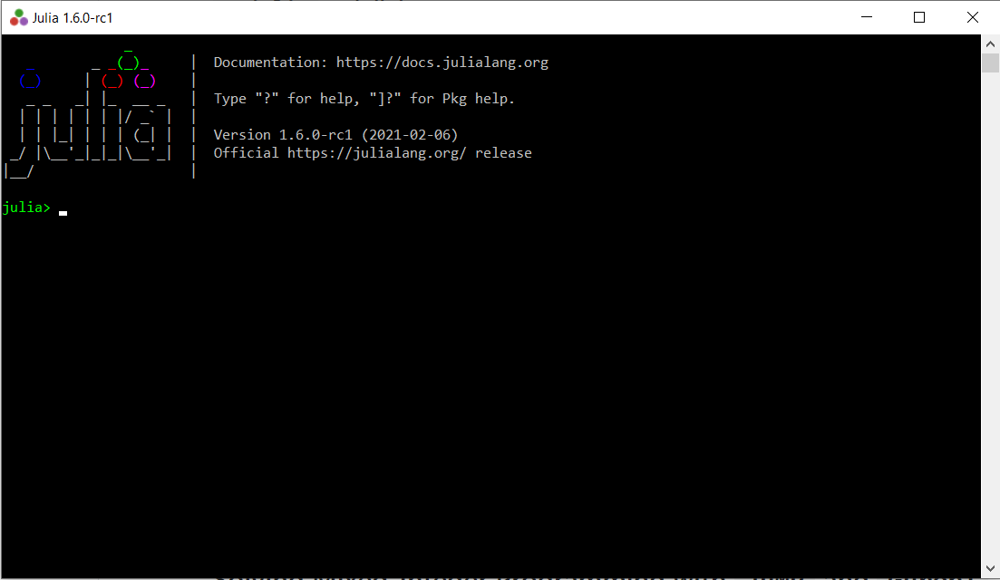
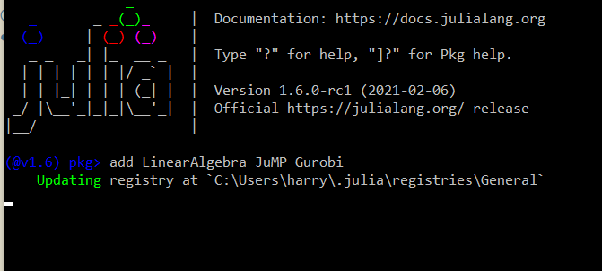

The instructions below walks you through setting up the julia backend.

## Installation

### Prerequisites

0. Operating System: **Windows 10**

1. [Rhinoceros 3D >=6.0](https://www.rhino3d.com/):

    We will use Rhino / Grasshopper as a frontend for inputting
    geometric and numeric paramters, and use various C#/julia packages as the computing backends.

2. [Miniconda](https://docs.conda.io/en/latest/miniconda.html)

    We will install all the required python packages using 
    `Miniconda` (a light version of Anaconda). Miniconda uses 
    **environments** to create isolated spaces for projects' 
    depedencies.

3. [Julia>=1.6](https://julialang.org/downloads/).

    Please download installer from the stable release `v1.6.0`.

4. [GHPythonRemote](https://github.com/pilcru/ghpythonremote).

    Main package that allows us to call external python packages within the GHPython environment.

5. [pyjulia](https://github.com/JuliaPy/pyjulia):

    Main package that allows us to call Julia from python.

Now, please click on the links above to install `1-3` (`Rhino`, `Miniconda`, and `Julia`).
The following sections walk you through installing `4` and `5` step-by-step.

### Creating a conda environment

Unfortunately, [GHPythonRemote](https://github.com/pilcru/ghpythonremote) requires a Python 2.7 installation, 
and it's not compatible with Python 3.
It is recommended to set up a conda environment to create a clean, isolated space for
installing the required python packages.

Miniconda uses a command line as an interface. Unfortunately, we need to work with this super non-graphical interface in most of the installation process. 
You might want to take a look at [this tutorial](https://www.wikihow.com/Change-Directories-in-Command-Prompt) to learn about how to navigate through directories in a command line prompt.

In the prompt, you can change file locations, create virtual environments, install and manage libraries, run programs, etc. by typing commands.

<details><summary>Tips on opening the anaconda prompt:</summary>
The easiest way to invoke the anaconda prompt on a Windows machine is to type in Anacon (autocomplete) in your search bar...


</details>

Type in the following commands in your Anaconda terminal 
(search for ``Anaconda Prompt`` in the Windows search bar):

```
    conda create --name py27 python=2.7 numpy scipy
```

Wait for the building process to finish, the command above will
fetch and build all the required packages, which will take some time (1~2 mins).

Then, activate the newly created conda environment (with all the needed packages installed):

```
    conda activate py27
```

### Install `GHPythonRemote`

In the anaconda terminal from the last section, issue the following to install `ghpythonremote`:

```bash
pip install gh-python-remote --upgrade
python -m ghpythonremote._configure_ironpython_installation 6
```
(replace `6` with `7` if you are working with Rhino 7 instead of 6.)

If the installation went smoothly, you should see something like this:


### `pyjulia` installation 

:construction: Please make sure that you've installed Julia from [here](https://julialang.org/downloads/) before you proceed on this step.

Keep using the anaconda terminal, issue the following to install
`pyjulia`:

```
pip install julia
```

Verify that your installation is successful:

```
$ python
>>> import julia
>>> julia.install()               # install PyCall.jl etc.
>>> from julia import Base        # short demo
>>> Base.sind(90)
1.0
```

<details><summary>the step above should look at the following in your Julia terminal:</summary>



</details>

The downloading and precompilation will likely take a while (~4 mins). 

But now you are done :tada:! Open the Grasshopper script `Geodesic_Reuse_v2.gh` with the Rhino file `sample house_r6_3.3dm`, and the julia backend should be working now!

## Solving Mixed-Integer Programming with `JuMP` and `Gurobi`

With the help of [JuMP.jl](https://github.com/jump-dev/JuMP.jl), we can easily replicate the MILP formulation using use the Gurobi optimizer, as proposed in [[Brütting et al. 2020]](https://www.frontiersin.org/articles/10.3389/fbuil.2020.00057/full#B6). 

### Obtain the academic Gurobi license

Gurobi is a fairly expensive commerical optimization software, but we can obtain free academic licenses [here](https://www.gurobi.com/academia/academic-program-and-licenses/).
Follow instructions in the `Individual Academic Licenses` section, and make sure that you did the last step on `grbgetkey `.

### Install additional Julia packages

We need to install a few more julia packages for optimization. Launch Julia command prompt by searching for julia in your search bar:



Then, issue `]` to enter the [package manager mode](https://pkgdocs.julialang.org/v1/getting-started/#Basic-Usage),
and install the required packages:

```julia
# type in "]"
julia>]
(@v1.6) pkg> add LinearAlgebra JuMP Gurobi
```

<details><summary>the step above should look at the following in your terminal:</summary>



</details>

Wait for the installation to finish, and we should be able to use their power in Grasshopper!