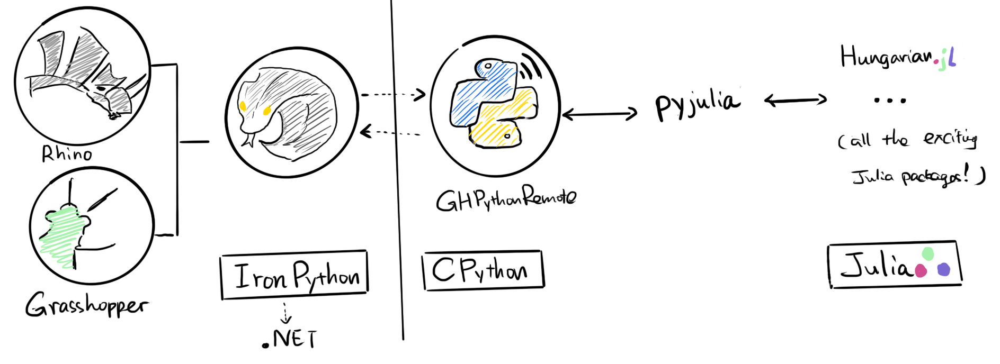
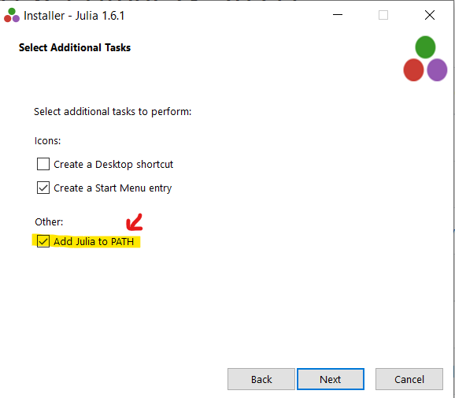
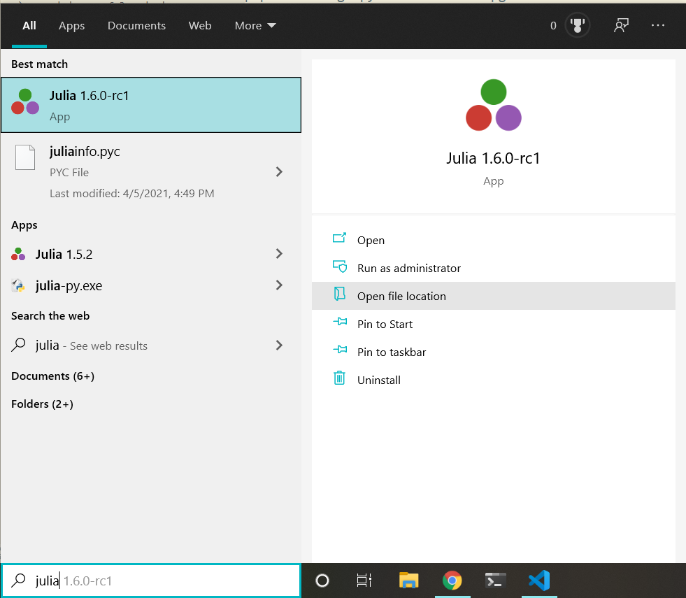
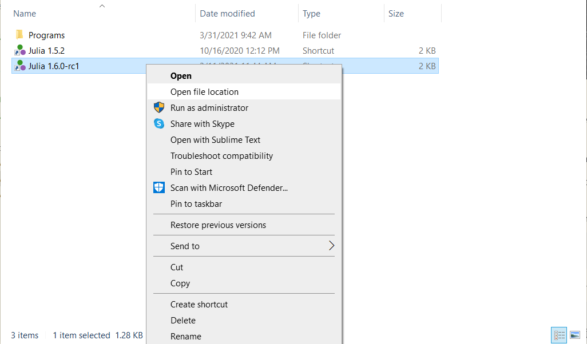

## 1. Overview



The instructions below walks you through setting up the julia backend to perform the optimal matching computation. As of June, 2021, Rhino 6 and Grasshopper is built on [IronPython](https://ironpython.net/) and still do not offer direct support for [CPython](https://www.python.org/downloads/) and Julia. Thus, we use a rather convoluted, two-level communication software pipeline to allow us to connect `IronPython-CPython-Julia` and take advantage of Julia's speed inside Rhino/GH. 
First, to enable communication between the IronPython environment inside Rhino/GH with the external CPython environment, we use `GHPythonRemote`, a python package operating on a python 2.7 (CPython) environment. Then, using the `pycall` packages inside that CPython environment, we can have CPython to talk to Julia.

**Update:** In Rhino 7, there is the new [Hops component](https://developer.rhino3d.com/guides/grasshopper/hops-component/) for Grasshopper that offers [a new way to create CPython component in Grasshopper](https://discourse.mcneel.com/t/create-cpython-components-using-hops-in-grasshopper/120517).
Although we haven't tested yet, we might be able to eliminate the need of the GHPythonRemote part in the image above, and directly call in Julia using `pyjulia` from CPython inside Grasshopper.

## 2. Prerequisites

Here are the list of software and packages that we need in this tutorial.
Now, please click on the links below to install `1-2` (`Rhino`, and `Miniconda`).
The following sections walk you through installing `3-5` step-by-step.

0. Operating System: **Windows 10**
1. [Rhinoceros 3D >=6.0](https://www.rhino3d.com/):
    We will use Rhino / Grasshopper as a frontend for inputting
    geometric and numeric paramters, and use various C#/julia packages as the computing backends.
2. [Miniconda](https://docs.conda.io/en/latest/miniconda.html):
    We will install all the required python packages using 
    `Miniconda` (a light version of Anaconda). Miniconda uses 
    **environments** to create isolated spaces for projects' 
    depedencies.
3. [Julia>=1.6](https://julialang.org/downloads/):
    Please download installer from the stable release `v1.6.0`.
4. [GHPythonRemote](https://github.com/pilcru/ghpythonremote):
    Main package that allows us to call external python packages within the GHPython environment.
5. [pyjulia](https://github.com/JuliaPy/pyjulia):
    Main package that allows us to call Julia from python.

## 3. Installing Julia

Please download and install Julia from [here](https://julialang.org/downloads/).

**Don't forget to enable the `Add Julia to environment path` in the installation!**



<details><summary>If you forget to do add Julia to path during the installation, you can do it by...</summary>

First find where your `julia.exe` executable resides. The easy way is to first type in `julia` in your search bar, and click `open file location`:



Then, right-click on the shortcut and click `open file location`. This will lead you to the path where julia is installed - it usually looks something like `C:\Users\<User name>\AppData\Local\Programs\Julia-1.6.0-rc1\bin`.



Copy that file path and then follow [these instructions](https://www.architectryan.com/2018/03/17/add-to-the-path-on-windows-10/) to add it to the environment path.

</details>

## 4. Creating a conda environment

Unfortunately, [GHPythonRemote](https://github.com/pilcru/ghpythonremote) requires a Python 2.7 installation, 
and it's not compatible with Python 3.
It is recommended to set up a conda environment to create a clean, isolated space for
installing the required python packages.

Miniconda uses a command line as an interface. Unfortunately, we need to work with this super non-graphical interface in most of the installation process. 
You might want to take a look at [this tutorial](https://www.wikihow.com/Change-Directories-in-Command-Prompt) to learn about how to navigate through directories in a command line prompt.

In the prompt, you can change file locations, create virtual environments, install and manage libraries, run programs, etc. by typing commands.

<details><summary>Tips on opening the anaconda prompt:</summary>
The easiest way to invoke the anaconda prompt on a Windows machine is to type in Anacon (autocomplete) in your search bar...


</details>

Type in the following commands in your Anaconda terminal 
(search for ``Anaconda Prompt`` in the Windows search bar):

```
    conda create --name py27 python=2.7 numpy scipy
```

Wait for the building process to finish, the command above will
fetch and build all the required packages, which will take some time (1~2 mins).

Then, activate the newly created conda environment (with all the needed packages installed):

```
    conda activate py27
```

## 5. Install `GHPythonRemote`

In the anaconda terminal from the last section, issue the following to install `ghpythonremote`:

```bash
pip install gh-python-remote --upgrade
python -m ghpythonremote._configure_ironpython_installation 6
```
(replace `6` with `7` if you are working with Rhino 7 instead of 6.)

If the installation went smoothly, you should see something like this:


## 6. `pyjulia` installation 

Keep using the anaconda terminal, issue the following to install
`pyjulia`:

```
pip install julia
```

Verify that your installation is successful:

```
$ python
>>> import julia
>>> julia.install()               # install PyCall.jl etc.
>>> from julia import Base        # short demo
>>> Base.sind(90)
1.0
```

<details><summary>the step above should look at the following in your Julia terminal:</summary>


</details>

The downloading and precompilation will likely take a while (~4 mins). 

But now you are done :tada:! Open the Grasshopper script `algorithmic_circular_dome.gh` and the julia backend should be working now!

## (Bonus) Install additional Julia packages

If we want to install a few more julia packages to do all kinds of cool stuff, e.g. do optimization with [JuMP](https://github.com/jump-dev/JuMP.jl) and [Gurobi](https://github.com/jump-dev/Gurobi.jl), launch Julia command prompt by searching for julia in your search bar:


Then, issue `]` to enter the [package manager mode](https://pkgdocs.julialang.org/v1/getting-started/#Basic-Usage),
and install the required packages:

```julia
# type in "]"
julia>]
(@v1.6) pkg> add LinearAlgebra JuMP GLPK
```

<details><summary>the step above should look at the following in your terminal:</summary>


</details>

Wait for the installation to finish, and we should be able to use their power in Grasshopper!