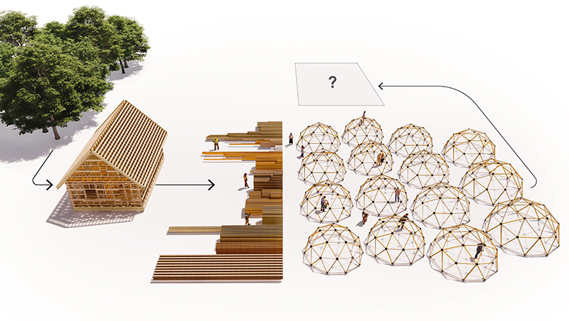
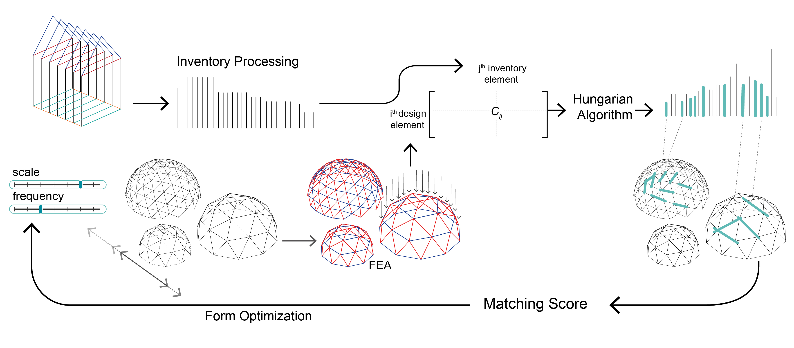

# algorithmic circular design




## Citation

- [Algorithmic circular design with reused structural elements: Method and Tool](https://web.mit.edu/yijiangh/www/papers/circular_dome_2021.pdf)

```bibtex
    @inproceedings{huang2021circular,
      title={Algorithmic circular design with reused structural elements: Method and Tool},
      author={Huang, Yijiang and Alkhayat, Latifa and De Wolf, Catherine and Mueller, Caitlin Tobin},
      booktitle={Proceedings of International FIB symposium of Conceptual Design of Structures},
      year={2021}
    }
```

All the images (except for screenshots) shown in this repo and the paper are credited to [Latifa Alkhayat](https://www.linkedin.com/in/latifa-alkhayat-78938712a/).

## Script overview



The overall algorithm workflow is summarized in the image above. More details may be found in the paper.

Everything in the workflow is implemented using standard Grasshopper components and off-the-shelf GH packages. Please install these Grasshopper packages before opening the script:

- A single geodesic dome is parametrized by [RhinoPolyhedron](https://www.food4rhino.com/en/app/rhinopolyhedra).
- Finite Element Analysis is done with [Karamba](https://manual.karamba3d.com/). You will need the fully featured version since we easily go over the number of element limitation of the trial version.
- Design Space Exploration (design space sampling, single- and multi-objective optimization) is done with [DSE](https://www.food4rhino.com/en/app/design-space-exploration). You will additionally need the [SelectablePreview](https://www.grasshopper3d.com/group/selectable-preview) plugin for sifting designs from the MOO plot.

The house inventory geometry is internalized in GH. The original house model is from the [House Frame from BAHC on 3D Warehouse](https://3dwarehouse.sketchup.com/model/62aef36d-ce14-440b-be54-d20ad8b1a4e1/House-Frame).

### Hungarian Algorithm implementations

This repo contains two different implementations to use the [Hungarian algorithm](https://en.wikipedia.org/wiki/Hungarian_algorithm): one using C#, the other one using a backend written in the [Julia programming language](https://github.com/JuliaLang/julia). They produce identical optimal matching in most cases with minor difference due to numerical scaling difference. Thus, you are recommended to disable the unused one to save unnecessary computation (especially if you chose to use the Julia backend).


The C# implementation uses [@vivet](https://github.com/vivet)'s [HungarianAlgorithm](https://github.com/vivet/HungarianAlgorithm) implementation (MIT licensed, compiled as `HungarianAlgorithm.dll`), and requires no extra effort to setup, simply open the Grasshopper script `algorithmic_circular_dome.gh` with the Rhino 6, and it works out of the box!

To use the Julia backend, however, we need some extra setup, but it's worth the effort - we've reported at least 10 times speedup with the julia backend compared to the C# one! In the screenshot above, the GH component profiler shows that the Julia backend takes 233 milliseconds, while the C# component takes 10.6 seconds, while producing similar matching cost. The instructions for setting up the GH-Julia workflow is [here](./gh_julia_instructions.md).